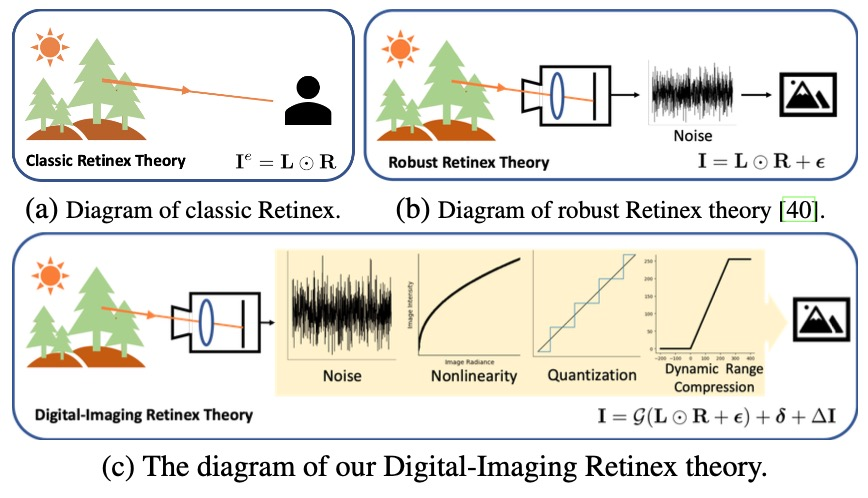

# <p align=center> [IJCV 2025] Di-Retinex: Digital-imaging retinex theory for low-light image enhancement</p>

<div align="center">

[]()
[]([https://arxiv.org/abs/2407.10172](https://arxiv.org/abs/2404.03327))
[](https://sunsean21.github.io/di-retinex.html)   
[](https://github.com/sunshangquan/Di-Retinex/issues?q=is%3Aissue+is%3Aclosed) 
[](https://github.com/sunshangquan/Di-Retinex/issues) 

|  |
|:-------------------------:|
| Network structure |


## Requirement

The following environment is tested:
PyTorch 1.9
Python 3.8

## Usage
### Test
```
  python3 lowlight_test.py --lowlight_images_path [PATH_TO_LOW_LIGHT_IMAGE_PATH] --model_path [MODEL_PATH] --save_path [SAVE_PATH] --out_ch [2 for small/6 for normal] --inner_ch [4 for small/64 for normal]
```


#### Example

```
  pythonC lowlight_test.py --lowlight_images_path data/lolv1 --model_path weights/latest (21.54 lolv1).pth --save_path result/lolv1 --out_ch 6 --inner_ch 64
```


## Train

```
  python3 lowlight_train.py
```

